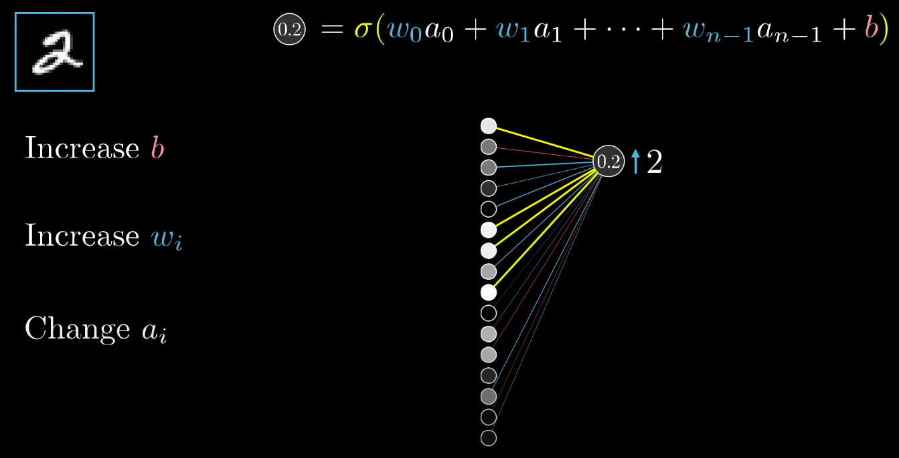
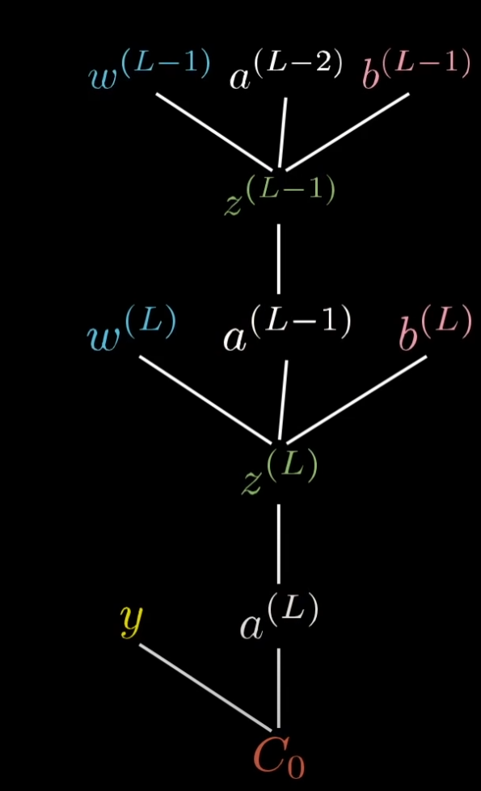

<style>
img {
  display: block;
  margin: 0 auto;
}

section::after {
  content: attr(data-marpit-pagination) ' / ' attr(data-marpit-pagination-total);
}
</style>

# Deep Learning

Algorytmy wykorzystujące sieci neuronowe składające się z więcej niż trzech warstw. Znajdują swoje zastosowanie w między innymi rozpoznawaniu obrazów, mowy, procesowaniu języka naturalnego.

---


<!-- Tutaj narazie powiedzieć, że są warstwy i do czego one służą -->

---

Sieci deep learningowe, mogą mieć wiele ukrytych wartsw. Można sobie wyobrazić, że dane wejściowe są w najprostszym poziomie reprezentacji, a następne warstwy zwiększają poziomy abstrakcji, aż w warstwie wyjściowej mamy najwyższy poziom abstrakcji, którym jest odpowiedź na zadane pytanie.

<!-- Tutaj można posłużyć się przykładem rozpoznawania cyfr
wejście obraz 28x28=784 wejść
pośrednie warstwy 1. krawędzie
2. kształy
3. output - cyfry -->

---


---


---


---

# Działanie neuronu


---

Neuron przechowuje w sobie wartość zwaną aktywacją, która może przyjąć wartość $<0,1>$. Wartość ta jest obliczana następująco:

- Bierzemy aktywacje z poprzedniej warstwy: $a_1,a_2,...,a_n$
- Bierzemy wagi związane z tymi aktywacjami: $w_1,w_2,...,w_n$
- Przemnażamy wagi przez aktywacje oraz sumujemy je
  $\sum_{i=1}^nw_ix_i$
- Dodajemy bias, czyli to jak łatwo lub ciężko aktywować neuron
  $z=\sum_{i=1}^nw_ix_i + b$
- Aby otrzymać wartość z przedziału $<0,1>$ przepuszczamy $z$ przez funkcję aktywacji

---

Neuron przechowuje w sobie wartość $<0,1>$, ale można myśleć o nim jako funkcji, która przyjmuje $n$ wartości i dla nich zwraca wartość $<0,1>$

---

# Wiele neuronów


---

<style scoped>section {padding-top: 5rem}</style>

$$
f_{activate}(\left(\begin{array}{cc}
w_{0,0}^{(L)} & w_{0,1}^{(L)} & ...& w_{0,n}^{(L)}    \\
w_{1,0}^{(L)} & w_{1,1}^{(L)} & ...& w_{1,n}^{(L)}    \\
... & ... & ... & ...               \\
w_{k,0}^{(L)} & w_{k,1}^{(L)} & ... & w_{k,n}^{(L)}   \\
\end{array}\right)

\left(\begin{array}{cc}
a_0^{(L-1)}\\
a_1^{(L-1)}\\
...        \\
a_n^{(L-1)}\\
\end{array}\right) +

\left(\begin{array}{cc}
b_0^{(L)}\\
b_1^{(L)}\\
...        \\
b_k^{(L)}\\
\end{array}\right)) =
\left(\begin{array}{cc}
a_0^{(L)}\\
a_1^{(L)}\\
...        \\
a_k^{(L)}\\
\end{array}\right)
$$

$n$ - liczba neuronów w warstwie poprzedniej
$k$ - liczba neuoronów w warstwie następnej

---

<style scoped>section {padding-top: 8rem}</style>

```python
z = numpy.dot(weights[L], activations[L-1]) + biases[L]
current_activations = activation_func(z)
activations.append(current_activations)
```

---

# Funckje aktywacji

---

# Sigmoid

$f(x) =\frac{1}{1 + e^{-x}}$  


---

# RELU

Rectified Linear Unit $f(x) = max(0, x)$


---

# Funkcja kosztu

---


---

<style scoped>section {padding-top: 8rem; text-align: center}</style>

$C = \sum_{i=0}^{n-1}(a_i - y_i)^2$

---

Jeżeli wartość kosztu jest duża, oznacza to, że sieć dla podanych wejść nie jest w stanie zwrócić poprawnej odpowiedzi. Aby nauczyć sieć odpowiadać poprawnie dla danych wejściowych trzeba skonfigurować odpowiednio jej wagi i biasy. Konfiguracja ta odbywa się za pomocą minimalizacji funkcji kosztu. Funkcja kosztu przyjmuje jako parametry wagi i biasy, a zwraca koszt.

---

# Pochodna


---


---

# Minimalizacja funkcji jednej zmiennej

1. liczymy pochodną tej funkcji
2. przyjmujemy losową pozycję (wybieramy jakiegoś x)
3. liczymy nachylenie funkcji poprzez podstawienie wartości x do pochodnej
4. jeśli wartość jest dodatnia to musimy przesunąć x w lewo
5. jeśli wartość jest ujemna to musimy przesunąć x w prawo
6. powtarzamy punkty 3-5 do momentu aż nachylenie będzie odpowiednio małe (można sobie założyć jakąś zadawalającą wartość)

---

# Backpropagation

Celem sieci deep learningowej jest osiągnięcie jak najmniejszego kosztu dla danych testowych. Może to osiągnąć za pomocą konfiguracji swoich parametrów, czyli wag i biasów. W algorytmie backpropagation liczymy gradient funkcji kosztu, który powie nam jak dane parametry wpływają na sieć - będziemy wtedy wiedzieli jak je zmodyfikować.

---

<!-- Tutaj dzięki wykonanie algorytmu backpropagation pomoże nam uzyskać rządany wynik, czyli aktywacja bliska wartości neuronu 2 i równa 0 dla innych  -->


---



---


---

Aby policzyć gradient funkcji kosztu musimy policzyć jak bardzo wpływają na nią wagi i biasy. Jak to zrobić?

---


---

<style scoped>section {padding-top: 8rem; text-align: center}</style>

$\frac{\partial C}{\partial w^{(L)}}$

$\frac{\partial C}{\partial b^{(L)}}$

$\frac{\partial C}{\partial a^{(L-1)}}$

---

<style scoped>section {padding-top: 5rem; text-align: center}</style>

$C = (a^{(3)} - y)^2$

$a^{(3)} = f_{activate}(w^{(3)}a^{(2)} + b^{(3)})$

$z^{(3)} = w^{(3)}a^{(2)} + b^{(3)}$

$a^{(3)} = f_{activate}(z^{(3)})$

---


---

# Chain rule

$\frac{\partial C}{\partial w^{(L)}} = 
\frac{\partial z^{(L)}}{\partial w^{(L)}}
\frac{\partial a^{(L)}}{\partial z^{(L)}}
\frac{\partial C^{(L)}}{\partial a^{(L)}}$

$\frac{\partial C}{\partial b^{(L)}}= 
\frac{\partial z^{(L)}}{\partial b^{(L)}}
\frac{\partial a^{(L)}}{\partial z^{(L)}}
\frac{\partial C^{(L)}}{\partial a^{(L)}}$

$\frac{\partial C}{\partial a^{(L-1)}}= 
\frac{\partial z^{(L)}}{\partial a^{(L-1)}}
\frac{\partial a^{(L)}}{\partial z^{(L)}}
\frac{\partial C^{(L)}}{\partial a^{(L)}}$

---

$C = (a^{(3)} - y)^2 = a^{2(3)} - 2a^{(3)}y + y^2$

$z^{(3)} = w^{(3)}a^{(2)} + b^{(2)}$

$a^{(3)} = f_{activate}(z^{(3)})$

$\frac{\partial C}{\partial w^{(3)}} = 
\frac{\partial z^{(3)}}{\partial w^{(3)}}
\frac{\partial a^{(3)}}{\partial z^{(3)}}
\frac{\partial C^{(3)}}{\partial a^{(3)}} =
 a^{(2)}f_{activate}'(z^{(3)})2(a^{(3)} - y)$

$\frac{\partial C}{\partial b^{(3)}}= 
\frac{\partial z^{(3)}}{\partial b^{(3)}}
\frac{\partial a^{(3)}}{\partial z^{(3)}}
\frac{\partial C^{(3)}}{\partial a^{(3)}} =
 f_{activate}'(z^{(3)})2(a^{(3)} - y)$

$\frac{\partial C}{\partial a^{(2)}}= 
\frac{\partial z^{(3)}}{\partial a^{(2)}}
\frac{\partial a^{(3)}}{\partial z^{(3)}}
\frac{\partial C^{(3)}}{\partial a^{(3)}} =
 w^{(3)}f_{activate}'(z^{(3)})2(a^{(3)} - y)$

---



---


---

# Źródło

Większość obrazów wykorzystanych w prezentacji to screenshoty z filmów stworzonych przez Granta Sandersona - 3Blue1Brown.

https://www.youtube.com/watch?v=aircAruvnKk&list=PLZHQObOWTQDNU6R1_67000Dx_ZCJB-3pi
https://www.3blue1brown.com/topics/neural-networks

---

# Link do prezentacji

https://github.com/Shady6/Prezentacja-Deep-Learning
